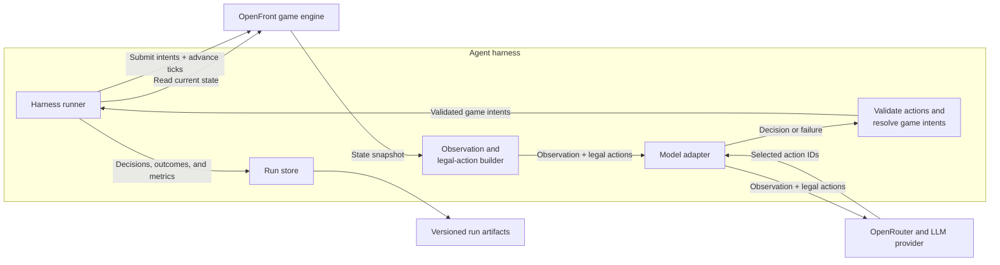
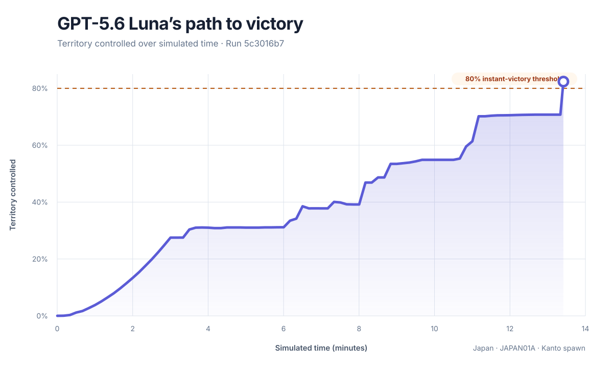
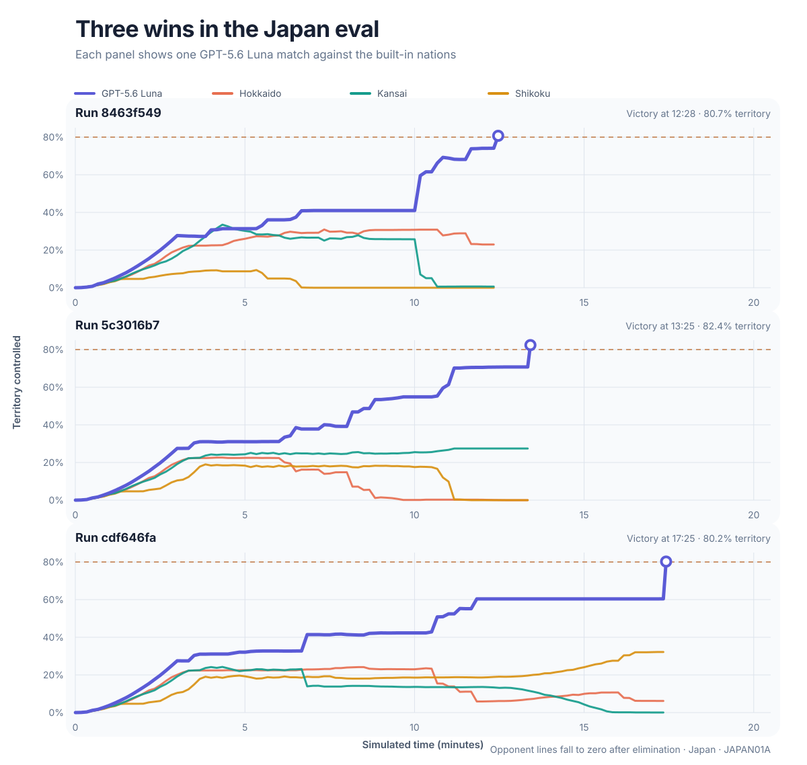
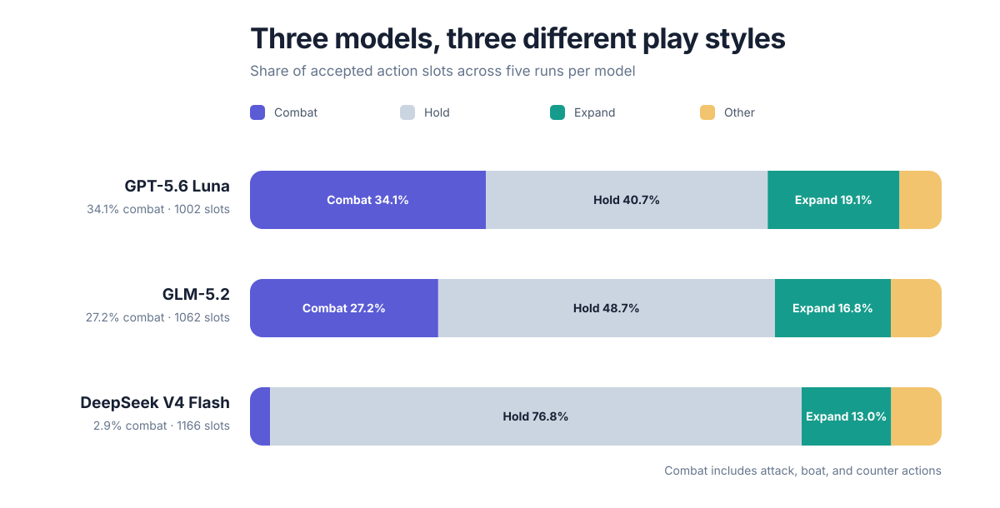

# Building a Reliable Agent Harness for OpenFront

<CLIP OF ATTACK-2-CLIPPED.mov HERE>

Harnesses enable LLMs to do more than produce text. They turn it into a system that can observe an environment, choose actions, use tools, and work toward a goal over time.

In the real world, harnesses need to be reliable. An unreliable harness turns a model mistake (or even what the model thinks is a correct decision) into an incorrect action. The main danger is that the harness connects probabilistic reasoning to deterministic systems such as databases, payment APIs, production infrastructure, robots, and customer accounts.
For example, if the model says “refund the latest $10 duplicate charge” but the harness refunds every $10 charge, that could be thousands in financial losses to the company.

The central engineering problem around bringing harnesses to production environments is "How do you make the harness reliable?".

To learn how to build a reliable harness, I built an agent harness around [OpenFront](https://openfront.io/), an open-source real-time strategy game. In this harness, an LLM plays a complete match against three built-in nations. Instead of giving the model authority to issue arbitrary game commands, I built a system that controls what the model can observe, limits it to legal and resource-safe actions, bounds every run, and records the game and model's thinking for auditability.


## 2. OpenFront in 60 seconds

OpenFront is an open-source, browser-based real-time strategy game about territorial control. Each player begins with a small foothold on a map based on real-world geography, then sends troops into neutral land or enemy territory to expand. Troops regenerate over time, but every attack also pulls strength away from defense, so growing too quickly can leave a player exposed. Gold adds another layer: it can be invested in cities, ports, defenses, and military units, while naval invasions and alliances create routes around an otherwise unfavorable land border.

In the match used by this harness, one player competes against three built-in nations on Japan. The world keeps moving in simulation ticks. In each tick, troops grow, attacks advance, nations respond, buildings finish, and borders change. A player wins immediately by capturing 80% of territory on the map. If time expires first, the surviving player with the most territory wins.

## 3. How the harness works



Every 100 ticks, the harness reads the current OpenFront state and gives the model a compact observation: time, standings, troops, gold, nearby opponents, active attacks, recent outcomes, and a safe troop budget.

Let's give an example from replay `9f73a404-ae98-430f-be5b-ea22fb1755a6`. At 5:50 into the match, the agent controlled 31.884% of Japan with 290,851 troops. It shared land borders with Kansai and Hokkaido, while Shikoku was reachable across the water.

```json
{
    "observation": {
      "elapsedTime": "05:50",
      "territoryPercent": 31.884,
      "troops": {
        "total": 290851,
        "reserve": 102486,
        "spendable": 188364,
        "perActionBudget": 94182
      },
      "opponents": [
        {
          "name": "Hokkaido",
          "troops": 93158,
          "sharedBorder": true
        },
        {
          "name": "Kansai",
          "troops": 55101,
          "sharedBorder": true
        },
        {
          "name": "Shikoku",
          "troops": 66632,
          "sharedBorder": false
        }
      ]
    }
  }
```

From the same state, the harness builds a menu of actions that are legal at that moment. These can include expanding, attacking, launching a boat, retreating, constructing or upgrading a building, changing diplomacy, and holding. Each option has a stable ID and maps to an exact OpenFront intent. 

```json
"legalActionExcerpt": [
    {
      "id": "attack:jld9qemv:100",
      "label": "Attack Kansai by land with 94,182 troops"
    },
    {
      "id": "attack:mx6susv9:100",
      "label": "Attack Hokkaido by land with 94,182 troops"
    },
    {
      "id": "boat:d8c1rits:100",
      "label": "Invade Shikoku by sea with 94,182 troops"
    },
    {
      "id": "alliance:request:d8c1rits",
      "label": "Request an alliance with Shikoku"
    },
    {
      "id": "embargo:start:jld9qemv",
      "label": "Start an embargo against Kansai"
    },
    {
      "id": "hold:1",
      "label": "Hold the first action slot"
    }
  ]
```

Both the observation and legal actions from above are fed as input into the model. The model chooses up to two IDs instead of generating raw game commands. In this example, the model chose to attack Kansai by land with 94,182 troops and invade Shikoku by sea with 94,182 troops.
```json
{
  "strategy": "Exploit overwhelming reserves: launch decisive attacks on the two weakest rivals while retaining the required 35% troop floor.",
  "action1": "attack:jld9qemv:100",
  "action2": "boat:d8c1rits:100"
}
```
The harness only accepts valid moves that it gave to the model as legal actions. To prevent hallicunation from the model, the harness validates the response locally before executing it. Shared troop budgets prevent two individually valid attack actions from spending more than the troop count available.

Once the harness submits an accepted action, OpenFront’s game engine applies it and determines the outcome according to the game’s rules. At the next desicion point 100 ticks later, the harness observes the new state and includes recent action outcomes, so the model can view the results of a previously submitted attack or building.

If a model request times out or returns an invalid response, the harness retries once with the validation error. If that also fails, the harness holds off from submitting an action by submitting a "hold" action.

At each decision point, the harness records the state shown to the model, the actions the model selected, any provider or validation errors, and the latency and cost of the request. This is to be able to audit the harness and the model's performance.

This cycle repeats until a player wins or the match reaches its time limit.

## 4. Why is reliability hard? How do you test a harness when the LLM is nondeterministic?

A production harness should make its reliability guarantees explicit before the model ever acts. It should constrain what the model can do, make unsafe choices unrepresentable, verify what the environment actually executes, and preserve enough evidence to explain every result.

OpenFront makes those reliability problems concrete. The game expects precise commands, while an LLM produces probabilistic text. If I exposed the game's raw intent types directly, the model could invent a player ID, attack an unreachable target, build on an invalid tile, spend the same troops twice, or return malformed JSON. Even a syntactically correct action might no longer be valid by the time the simulation applied it.

I defined reliability across three dimensions:

1. **Action reliability:** every accepted decision must resolve to legal, resource-safe game intents.
2. **Operational reliability:** each run remains bounded in latency and cost, and degrades safely when the model provider fails.
3. **Evaluation reliability:** runs are inspectable and replayable, allowing model failures to be distinguished from harness failures. Furthermore, is the agent playing the game in a way that makes sense wins? 

The harness enforces these three properties by design rather than relying on a longer prompt to make the model perfectly reliable. The legal-action interface addresses action reliability. Validation, retries, and safe holds prevent malformed provider responses from becoming invalid game commands. Cost ceilings, rate limits, and atomic storage address operational reliability. Versioned artifacts, hashes, and replay address evaluation reliability.

This is why I treat the harness as the product. The model is replaceable. The observation contract, action boundary, simulator integration, failure handling, artifact format, replay, and verification path are what make its behavior trustworthy enough to use.

## 5. How I made the harness reliable.

Each of the three dimensions from above is enforced by a different part of the harness, and each surfaced differently once real models started playing.
 
### Evaluation reliability: making every run auditable
 
One of my key design decisions was to make every run auditable. At each decision point, the harness records what the model observed, which actions it could take, what it chose, and why. This let me watch the agent play, inspect unexpected decisions or error flags, and use the trace to determine whether a problem came from the model or from the harness. To judge replays concretely, I checked two things: whether the agent was making moves a real player would plausibly make, and how many of its turns produced an error. The first was a judgment call from watching the replay, the second was a direct count from the trace.
 
That auditability is also what let me diagnose two of the more interesting failures I ran into, rather than just seeing an agent lose and guessing why.
 
An early version of the observation JSON called the immediate territory threshold `winPercent`. In one evaluation, GLM-5.2 interpreted a value of `80` as an 80% probability of winning and used it to justify holding off from any action, even though it controlled far less than 80% of the map. Because the decision trace showed exactly what the model had seen and how it reasoned from that value, I could pin the failure to the field name rather than the model's judgment. To fix this, I renamed the field to `instantVictoryTerritoryPercent`, and GLM-5.2 won in its next run. From this, I learned that even a small ambiguity in the wording of a state variable could cause the model to behave incorrectly.
 
In another run with DeepSeek V4 Flash, an older version of the instruction prompt told the model to "hold while rebuilding," but did not explain that troop growth approaches zero near full capacity. The model made no moves for 58 of its 61 decisions, stopped gaining meaningful troops, and was eventually conquered by another nation. This failure did not trigger a harness error because every hold was valid. The trace revealed the problem, where the model repeatedly chose to hold because it believed doing so would rebuild its troops, even near full capacity. I removed the "hold while rebuilding" instruction and made the underlying troop-growth mechanic explicit. More specifically, the observation now reports the agent's troop-capacity percentage and current growth rate, and the prompt explains that holding near 100% capacity will not rebuild the army further. As a result, the next DeepSeek run, the agent expanded aggressively and reached first place!
From this, I learned the importance of not having biases in a prompt, and the importance of exposing more relevant information to the model for it to use when making a decision.
 
Both cases point to the same lesson: the harness should prevent invalid actions, but it should not encode an entire winning strategy. That's why, when deciding between improving performance through more prompt engineering versus exposing more raw game state, I chose the latter. It keeps the harness neutral and lets a bad choice belong to the model rather than a harness issue.

### Operational reliability: staying inside latency and cost budgets
 
Latency was one of the first constraints. With reasoning set to low, median end-to-end latency was 2.5 seconds. Some requests took six seconds, and certain models exceeded the ten-second timeout. Disabling reasoning brought median latency below one second.
 
*[Insert latency distribution chart/table here]*
 
Provider behavior was another source of variability. Some providers occasionally failed to return a response, and providers serving the same model did not always use the same defaults. For DeepSeek, some providers enabled reasoning by default and produced more than 1,000 output tokens, often timing out, while others returned roughly 50 tokens. Setting the reasoning mode explicitly made behavior more consistent across providers.


### Action reliability: keeping every accepted move legal

The model never writes OpenFront commands directly. At each decision point, the harness reads the current game state and generates a deterministic menu of actions that are legal at that moment. Each option has a stable ID and maps to an exact game intent, so the model chooses from bounded capabilities instead of inventing player IDs, troop counts, build locations, or command shapes.

I enforce that boundary twice. The request uses a strict JSON Schema whose `action1` and `action2` enums contain only the IDs available to each slot for that decision. When the response returns, the harness parses it with Zod and checks both selections against the original menu again. This second check matters because structured output is supplied by an external provider; it improves reliability, but it is not a substitute for validation at the point where the harness grants authority.

A move also has to be safe in combination with the other move. The legal-action builder calculates one troop surplus above a reserve floor and divides it across the two action slots. It only offers troop amounts within those slot budgets, which prevents two individually valid attacks from spending the same troops twice. The resolver also replaces invalid duplicates, such as trying to construct two buildings on the same tile, with the appropriate slot's hold action.

If a response is malformed or selects an invalid ID, the harness retries once and includes the specific validation error so the model can correct itself. If the retry also fails, it submits two holds rather than guessing what the model intended. OpenFront remains the final authority after submission: an action that was legal when offered can still fail as the simulation changes, so the harness records whether each action actually started, failed, completed, or was destroyed and feeds recent outcomes into the next observation. This separates a legal model decision from a successful game outcome while ensuring that invalid model output never crosses the action boundary.

---

**Note — doesn't belong to the reliability framework above:** The frontend presented a different challenge from the harness itself. GPT was useful for quickly scaffolding most of the interface, but it tended to introduce unnecessary design elements and jargon. Refining the final portion into a clear, sales-oriented presentation required more manual judgment than generating the initial structure. This is worth keeping somewhere in the writeup, but probably in a separate section — as written here it reads as a stray topic change right after a reliability discussion.

## 6. Results and limitations

I ran three evaluations each of DeepSeek V4 Flash, GLM-5.2, and GPT-5.6 Luna. Every run used the same `japan-v5` scenario: the `JAPAN01A` seed, the Kanto spawn, three medium-difficulty built-in nations, one decision every 100 ticks, and a 20-minute limit. They also used the same `agent-v12` prompt contract with reasoning disabled. I pinned the provider as well as the model: StreamLake for DeepSeek, Baidu for GLM, and OpenAI for GPT, all through OpenRouter.

| Model and provider | Wins | How the wins ended | Mean final territory | Mean decisions | Mean prompt / completion tokens | Median decision latency | Mean inference cost |
| --- | ---: | --- | ---: | ---: | ---: | ---: | ---: |
| GPT-5.6 Luna / OpenAI | 3/3 | 3 at 80% | 81.1% | 87.0 | 229,773 / 4,829 | 1.02 s | $0.0315 |
| GLM-5.2 / Baidu | 3/3 | 1 at 80%, 2 on timer | 68.9% | 112.0 | 277,792 / 6,653 | 2.80 s | $0.0762 |
| DeepSeek V4 Flash / StreamLake | 2/3 | 2 timer wins, 1 loss | 29.9% | 114.3 | 289,736 / 5,785 | 2.89 s | $0.0229 |

GPT produced the strongest and most consistent results in this small sample. It crossed the 80% instant-victory threshold in all three runs, after 75, 81, and 105 decisions. GLM also won every run, but only one reached the threshold; its other two wins came from leading when the timer expired. DeepSeek's two wins were timer wins with 32.2% and 40.1% of the map, while its remaining run ended in second place with 17.5%. A binary win rate therefore hides a meaningful difference between conquering the map and surviving with a plurality of territory.



The shape of the win is easier to see in the decision trace. In the representative run above, GPT expanded rapidly for the first three minutes, consolidated around 30% of the map, then converted a series of later attacks into an 82.4% victory at 13:25.



Separating the three matches also shows that there was no single path to victory. GPT sometimes removed opponents early and sometimes let them survive deep into the match, but it ultimately established a territory lead and crossed the same 80% threshold in every run.

The decision traces show different play styles behind those outcomes. Counting attack, boat, and counter actions together, GPT used a combat action in 228 of 522 action slots (43.7%), compared with 221 of 672 for GLM (32.9%) and 21 of 686 for DeepSeek (3.1%). DeepSeek selected a hold in 76.2% of its slots and made no combat move at all in one of its two wins.

That passivity was not accidental. DeepSeek creatively recognized that it did not need to conquer 80% of the map: if it was still alive and held the most territory when time expired, it would win. Once it established a lead, its recorded strategies repeatedly said that holding would preserve the lead while the built-in nations fought one another. In the 40.1% win, it explicitly reasoned that holding preserved its troops "for timer victory." This turned inaction into a deliberate strategy: avoid the downside of further combat, protect a plurality of the map, and run out the clock. It worked in two of the three runs, although it also made DeepSeek's results more dependent on how its opponents behaved. GPT and GLM instead applied pressure more directly and accumulated substantially more territory.



The action boundary held across the complete set of 940 decisions. All 1,880 final action selections referred to candidates in the menu for that decision, every applied-action array matched the accepted selection, and no decision committed more troops than its observation's shared safe budget. Three initial responses—one from DeepSeek and two from GLM—tried to launch proactive attacks against two different opponents in the same turn. The semantic validator rejected each combination, and all three models corrected it on the single retry. No run reached the validation fallback. This is the behavior the harness is designed to produce: model errors remained visible in the trace but did not become game commands.

These results are illustrative, not a general model ranking. There are only three runs per model, all on one map, seed, spawn, opponent lineup, and difficulty. The action menu also deliberately excludes unsafe all-in attacks and understrength combat, so this measures play through the harness's abstraction rather than unrestricted OpenFront skill. Finally, model and provider are confounded in this comparison. The latency and cost figures describe these particular provider routes at the time of the runs; they do not isolate the underlying models and should not be treated as universal benchmarks.


## 7. What I would build next

Currently this harness works as to inspect how an agent plays a game. A more interesting next step for this harness would be to turn it into a public benchmark to evaluate how different LLMs perform.

This would be done by benchmarking on different maps, seeds, and spawn locations, alongside defining a scoring formula based on wins, placement, and territory.

Another interesting angle would be to implement multiagent support on the harness, so you can have multiple agents competing against each other (PvP, or more specificially Agent vs. Agent) as opposed to agent vs. 3 bots.

## 8. What I learned

Four lessons from this project will shape how I build future agent systems.

First, agent reliability depends as much on interface design as model capability. A bounded legal menu, shared resource accounting, explicit state semantics, and deterministic fallbacks did more for the system than adding increasingly prescriptive prompt text.

Second, observability should connect requests to real effects. Recording the model's answer was not enough. I needed to know which intents the harness applied, whether the game started them, how they resolved, and what state followed. Replay became both the user experience and the debugging tool.

Third, determinism has layers. I can reproduce a game trajectory from a recorded action trace, but I cannot honestly promise that a hosted model will generate the same trace forever. Separating environment reproducibility from policy reproducibility leads to better artifacts and more defensible benchmark claims.

Fourth, a model name is not a complete API contract. Different providers serving the same model can expose different features, defaults, data policies, latency, and failure modes. I encountered this directly with structured output: some endpoints supported JSON mode, which only asks for a valid JSON object, but not strict JSON Schema enforcement. Other providers for the same model supported the schema contract the harness required. Reasoning controls also varied, so relying on a provider's default could silently turn reasoning on and increase latency and output tokens. This means a reproducible evaluation must pin both the model and provider, check the endpoint's advertised capabilities, set options such as reasoning explicitly, record the provider that actually served each request, and still validate every response locally.

The broader takeaway is that an agent demo becomes substantially more credible when a reviewer can answer four questions:

1. What did the model know?
2. What was it allowed to do?
3. What did the real system execute?
4. Can the claimed result be replayed and verified?

This harness is my answer to those questions for a real-time strategy game.


# Is your company building harnesses? Let's chat!
