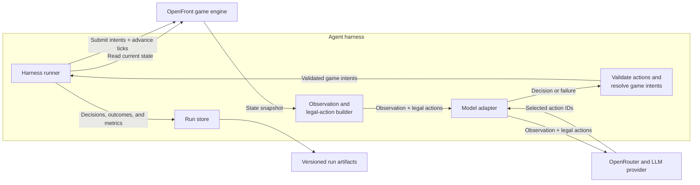

# Building a Reliable Agent Harness for OpenFront

<CLIP OF ATTACK-2-CLIPPED.mov HERE>

Harnesses enable LLMs to do more than produce text. They turn it into a system that can observe an environment, choose actions, use tools, and work toward a goal over time.

In the real world, harnesses need to be reliable. An unreliable harness turns a model mistake (or even what the model thinks is a correct decision) into an incorrect action. The main danger is that the harness connects probabilistic reasoning to deterministic systems such as databases, payment APIs, production infrastructure, robots, and customer accounts.
For example, if the model says “refund the latest $10 duplicate charge” but the harness refunds every $10 charge, that could be thousands in financial losses to the company.

The central engineering problem around bringing harnesses to production environments is "How do you make the harness reliable?".

To learn how to build a reliable harness, I built an agent harness around [OpenFront](https://openfront.io/), an open-source real-time strategy game. In this harness, an LLM plays a complete match against three built-in nations. Instead of giving the model authority to issue arbitrary game commands, I built a system that controls what the model can observe, limits it to legal and resource-safe actions, bounds every run, and records the game and model's thinking for auditability.


## 2. OpenFront in 60 seconds

OpenFront is an open-source, browser-based real-time strategy game about territorial control. Each player begins with a small foothold on a map based on real-world geography, then sends troops into neutral land or enemy territory to expand. Troops regenerate over time, but every attack also pulls strength away from defense, so growing too quickly can leave a player exposed. Gold adds another layer: it can be invested in cities, ports, defenses, and military units, while naval invasions and alliances create routes around an otherwise unfavorable land border.

In the match used by this harness, one player competes against three built-in nations on Japan. The world keeps moving in simulation ticks. In each tick, troops grow, attacks advance, nations respond, buildings finish, and borders change. A player wins immediately by capturing 80% of territory on the map. If time expires first, the surviving player with the most territory wins.

## 3. How the harness works



Every 100 ticks, the harness reads the current OpenFront state and gives the model a compact observation: time, standings, troops, gold, nearby opponents, active attacks, recent outcomes, and a safe troop budget.

Let's give an example from replay `9f73a404-ae98-430f-be5b-ea22fb1755a6`. At 5:50 into the match, the agent controlled 31.884% of Japan with 290,851 troops. It shared land borders with Kansai and Hokkaido, while Shikoku was reachable across the water.

```json
{
    "observation": {
      "elapsedTime": "05:50",
      "territoryPercent": 31.884,
      "troops": {
        "total": 290851,
        "reserve": 102486,
        "spendable": 188364,
        "perActionBudget": 94182
      },
      "opponents": [
        {
          "name": "Hokkaido",
          "troops": 93158,
          "sharedBorder": true
        },
        {
          "name": "Kansai",
          "troops": 55101,
          "sharedBorder": true
        },
        {
          "name": "Shikoku",
          "troops": 66632,
          "sharedBorder": false
        }
      ]
    }
  }
```

From the same state, the harness builds a menu of actions that are legal at that moment. These can include expanding, attacking, launching a boat, retreating, constructing or upgrading a building, changing diplomacy, and holding. Each option has a stable ID and maps to an exact OpenFront intent. 

```json
"legalActionExcerpt": [
    {
      "id": "attack:jld9qemv:100",
      "label": "Attack Kansai by land with 94,182 troops"
    },
    {
      "id": "attack:mx6susv9:100",
      "label": "Attack Hokkaido by land with 94,182 troops"
    },
    {
      "id": "boat:d8c1rits:100",
      "label": "Invade Shikoku by sea with 94,182 troops"
    },
    {
      "id": "alliance:request:d8c1rits",
      "label": "Request an alliance with Shikoku"
    },
    {
      "id": "embargo:start:jld9qemv",
      "label": "Start an embargo against Kansai"
    },
    {
      "id": "hold:1",
      "label": "Hold the first action slot"
    }
  ]
```

Both the observation and legal actions from above are fed as input into the model. The model chooses up to two IDs instead of generating raw game commands. In this example, the model chose to attack Kansai by land with 94,182 troops and invade Shikoku by sea with 94,182 troops.
```json
{
  "strategy": "Exploit overwhelming reserves: launch decisive attacks on the two weakest rivals while retaining the required 35% troop floor.",
  "action1": "attack:jld9qemv:100",
  "action2": "boat:d8c1rits:100"
}
```
The harness only accepts valid moves that it gave to the model as legal actions. To prevent hallicunation from the model, the harness validates the response locally before executing it. Shared troop budgets prevent two individually valid attack actions from spending more than the troop count available.

Once the harness submits an accepted action, OpenFront’s game engine applies it and determines the outcome according to the game’s rules. At the next desicion point 100 ticks later, the harness observes the new state and includes recent action outcomes, so the model can view the results of a previously submitted attack or building.

If a model request times out or returns an invalid response, the harness retries once with the validation error. If that also fails, the harness holds off from submitting an action by submitting a "hold" action.

At each decision point, the harness records the state shown to the model, the actions the model selected, any provider or validation errors, and the latency and cost of the request. This is to be able to audit the harness and the model's performance.

This cycle repeats until a player wins or the match reaches its time limit.

## 4. Why is reliability hard?

A production harness should make its reliability guarantees explicit before the model ever acts. It should constrain what the model can do, make unsafe choices unrepresentable, verify what the environment actually executes, and preserve enough evidence to explain every result.

OpenFront makes those reliability problems concrete. The game expects precise commands, while an LLM produces probabilistic text. If I exposed the game's raw intent types directly, the model could invent a player ID, attack an unreachable target, build on an invalid tile, spend the same troops twice, or return malformed JSON. Even a syntactically correct action might no longer be valid by the time the simulation applied it.

I defined reliability across three dimensions:

1. **Action reliability:** every accepted decision must resolve to legal, resource-safe game intents.
2. **Operational reliability:** each run remains bounded in latency and cost, and degrades safely when the model provider fails.
3. **Evaluation reliability:** runs are inspectable and replayable, allowing model failures to be distinguished from harness failures.

The harness enforces these properties by design rather than relying on a longer prompt to make the model perfectly reliable. The legal-action interface addresses action reliability. Validation, retries, and safe holds prevent malformed provider responses from becoming invalid game commands. Cost ceilings, rate limits, and atomic storage address operational reliability. Versioned artifacts, hashes, and replay address evaluation reliability.

This is why I treat the harness as the product. The model is replaceable. The observation contract, action boundary, simulator integration, failure handling, artifact format, replay, and verification path are what make its behavior trustworthy enough to use.

## 5. How I made the harness reliable.

How do you test that the harness works, if the LLM is undeterministic?

One of the key design decisions I had in mind while I was building this harness was to make the harness auditable. That is, there are logs produced for every decision the agent makes and why. This was helpful, as my approach to testing the model was to watch it play and see the results. Whenever there was an error flag that occured or the agent made a move that didn't make sense, I inputteed the logs into codex, gave it my reasoning on why it didn't make sense, and asked it to investigate if this was a model issue or a harness issue. One example of this was --FIND THE REPLAY & GIVE VISUAL--- It turns out that the agent kept attacking and not keeping its population, which meant enemies would have a higher population and be able to conquer it easily. This was a situation of the model not knowing this game mechanic, so I exposed it in the instruction prompt. 

## 5. What real agent runs taught me


An early observation json called the immediate territory threshold `winPercent`. In one evaluation, GLM-5.2 interpreted a value of `80` as an 80% probability of winning and used it to justify holding off from any action, even though it controlled far less than 80% of the map. I renamed the field to `instantVictoryTerritoryPercent` to fix the issue, and this taught me how important word choice is as even small misinterpretations can cause a model to behave incorrectly.s 

In another run with DeepSeek V4 Flash, an older version of the instruction prompt told the model to "Hold while rebuilding", but did not explain that troop growth approaches zero near full capacity. As a result, the model kept holding off from making any moves (118 of 122 actions were holds), and did not grow its troops causing it to be conqured by another bot. 

I fixed this by removing the "Hold while rebuilding" instruction and making the underlying troop growth mechanics explicit. The observation json input now reports the agent's troop capacity percentage and current growth rate, while the prompt explains that growth approaches zero near 100% capacity, so holding at capacity cannot rebuild the army any further. 

In the next DeepSeek run, the agent expanded aggressively and reached first place.


That is an important boundary: the harness can remove ambiguity and prevent invalid actions, but it should not encode the entire winning strategy. Once the state and action contract are clear, a bad tactical choice belongs to the policy rather than the interface.

## 6. Challenges and what I learned:

The main challenge of this project was making the harness more reliable.

- Latency: Having reasoning on set to low caused median end-to-end latency to be 2.5s. On some occasions, it would go for as high as 6 seconds, and on some models it would go beyond 10 seconds and timeout. Setting it to off brought median latency down to less than 1 second.
- Providers: Certain model providers are unreliable and may not provide a response when requested. Additionally, during this project I learned that some providers (for the same model) have different default settings. Some providers for deepseek would provide lengthy output (1000+ tokens) and timeout, while others would provide short output of 50 tokens. It turns out that without setting an explicit reasoning mode for Deepseek, some  model provders enabled reasoning on by default, while others disabled it.
- Improving performance of the harness by prompt engineering vs. making the harness expose more data from the game state to the model: I wanted to keep the harness neutral and not bias the model, so it was better to expose more data from the game state as input to the model, and instead have the prompt only explain the game mechanics as opposed to what it should / shouldn't do. 
- Reducing failed moves: structured prose? or what was done here?
- Designing the frontend to be sales oriented: GPT is very bad at designing websites, and overcomplicates it with unneeded design features and unnessecary jargon. It's great at scaffolding something that's 80% of the way there, but the last 20% of this frontend took the most bit of time.


The most useful bugs appeared where two reasonable components met.

### Two legal actions could spend the same troops twice

Each v1 action was legal by itself, but both slots spent percentages of one troop snapshot. The model could unintentionally drain its entire garrison or request more troops than existed.

I replaced independent percentages with one shared safe budget divided across the slots. This bug changed the action contract and required a new scenario version because old and new results were no longer directly comparable.


## 8. Results and limitations

The bundled run provides one complete example of the system:

| Metric                        |                    Result |
| ----------------------------- | ------------------------: |
| Model                         |     `openai/gpt-5.6-luna` |
| Provider                      | OpenAI through OpenRouter |
| Result                        |    LLM victory, 1st place |
| Decisions                     |                       106 |
| Prompt tokens                 |                   180,599 |
| Completion tokens             |                    20,095 |
| Inference cost                |                 $0.317779 |
| Average decision latency      |              3.35 seconds |
| Decisions requiring a retry   |                        15 |
| Complete validation fallbacks |                         8 |
| Terminal tick                 |                    10,561 |
| Simulated time                |             1,056 seconds |
| Final state hash              |        `4090602815772241` |

The win is encouraging, but it is not evidence that the model is generally good at strategy games. The current preset uses one map, one seed, one spawn, one opponent lineup, and one difficulty. A model can overfit those conditions, and hosted model behavior can change behind a stable name.

The action menu is also opinionated. It deliberately withholds unsafe all-in attacks and understrength combat. That makes runs safer and easier to compare, but it means the harness measures performance through its action abstraction rather than unrestricted OpenFront play.

Finally, latency and cost are observations from one provider path at one point in time. They are useful for inspecting a run, not universal model benchmarks.

I prefer stating those limits directly. A narrow result with a clear contract is more credible than a broad claim the project cannot support.

## 9. What I would build next

Currently this harness works as to inspect how an agent plays a game. A more interesting next step for this harness would be to turn it into a public benchmark to evaluate how different LLMs perform.

This would be done by benchmarking on different maps, seeds, and spawn locations, alongside defining a scoring formula based on wins, placement, and territory.

Another interesting angle would be to implement multiagent support on the harness, so you can have multiple agents competing against each other (PvP, or more specificially Agent vs. Agent) as opposed to agent vs. 3 bots.

## 10. What I learned

Three lessons from this project will shape how I build future agent systems.

First, agent reliability depends as much on interface design as model capability. A bounded legal menu, shared resource accounting, explicit state semantics, and deterministic fallbacks did more for the system than adding increasingly prescriptive prompt text.

Second, observability should connect requests to real effects. Recording the model's answer was not enough. I needed to know which intents the harness applied, whether the game started them, how they resolved, and what state followed. Replay became both the user experience and the debugging tool.

Third, determinism has layers. I can reproduce a game trajectory from a recorded action trace, but I cannot honestly promise that a hosted model will generate the same trace forever. Separating environment reproducibility from policy reproducibility leads to better artifacts and more defensible benchmark claims.

The broader takeaway is that an agent demo becomes substantially more credible when a reviewer can answer four questions:

1. What did the model know?
2. What was it allowed to do?
3. What did the real system execute?
4. Can the claimed result be replayed and verified?

This harness is my answer to those questions for a real-time strategy game.


# Is your company building harnesses? Let's chat!
