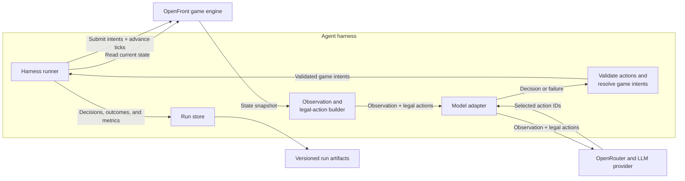
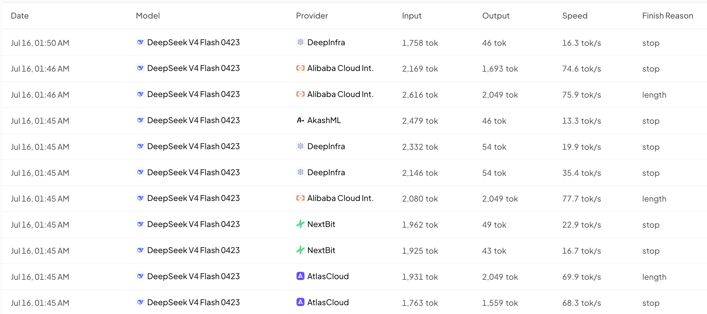
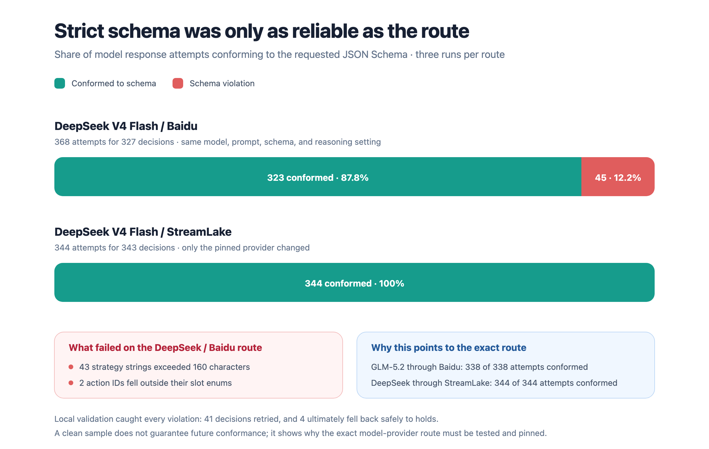

# Building a Reliable Agent Harness for OpenFront

Written by Fahim Ahmed

<CLIP OF ATTACK-2-CLIPPED.mov HERE>

Harnesses enable LLMs to do more than produce text. They turn it into a system that can observe an environment, choose actions, use tools, and work toward a goal over time.

In the real world, harnesses need to be reliable. An unreliable harness turns a model mistake (or even what the model thinks is a correct decision) into an incorrect action. The main danger is that the harness connects probabilistic reasoning to deterministic systems such as databases, payment APIs, production infrastructure, robots, and customer accounts.
For example, if the model says “refund the latest $10 duplicate charge” but the harness refunds every $10 charge, that could be thousands in financial losses to the company.

The central engineering problem around bringing harnesses to production environments is "How do you make the harness reliable?".

To learn how to build a reliable harness, I built an agent harness around [OpenFront](https://openfront.io/), an open-source real-time strategy game. In this harness, an LLM plays a complete match against three built-in nations. Instead of giving the model authority to issue arbitrary game commands, I built a system that controls what the model can observe, limits it to legal and resource-safe actions, places limits on runtime and model costs, and records the game and model's thinking for auditability.


## OpenFront in 60 seconds

[OpenFront](https://openfront.io/) is an open-source, browser-based real-time strategy game about territorial control. Each player begins with a small foothold on a map based on real-world geography, then sends troops into neutral land or enemy territory to expand. Troops regenerate over time, but every attack also pulls strength away from defense, so growing too quickly can leave a player exposed. Gold adds another layer, and can be invested in cities, ports, defenses, and military units, while naval invasions and alliances create routes around an otherwise unfavorable land border.

<OPENFRONT GAMEPLAY CLIP HERE>

In the match used by this harness, one player competes against three built-in nations on Japan. The game progresses in simulation ticks. In each tick, troops grow, attacks advance, nations respond, buildings finish, and borders change. A player wins immediately by capturing 80% of territory on the map. If time expires first, the surviving player with the most territory wins.

## How the harness works



Every 100 ticks, the harness reads the current OpenFront state and gives the model a compact observation. The observation contains information on time, standings, troops, gold, nearby opponents, active attacks, recent outcomes, and a safe troop budget.

Let's give an example from replay [9f73a404-ae98-430f-be5b-ea22fb1755a6](https://openfront.fahimahmed.ca/replay/9f73a404-ae98-430f-be5b-ea22fb1755a6). At 5:50 into the match, the agent controlled 31.884% of Japan with 290,851 troops. It shared land borders with Kansai and Hokkaido, while Shikoku was reachable across the water.

```json
{
    "observation": {
      "elapsedTime": "05:50",
      "territoryPercent": 31.884,
      "troops": {
        "total": 290851,
        "reserve": 102486,
        "spendable": 188364,
        "perActionBudget": 94182
      },
      "opponents": [
        { "name": "Hokkaido", "troops": 93158, "sharedBorder": true },
        { "name": "Kansai", "troops": 55101, "sharedBorder": true },
        { "name": "Shikoku", "troops": 66632, "sharedBorder": false }
      ]
    }
  }
```

From the same state, the harness builds a menu of actions that are legal at that moment. These can include expanding, attacking, launching a boat, retreating, constructing or upgrading a building, changing diplomacy, and holding. Each option has a stable ID and maps to an exact OpenFront game command. 

```json
"legalActionExcerpt": [
    { "id": "attack:jld9qemv:100", "label": "Attack Kansai by land with 94,182 troops" },
    { "id": "attack:mx6susv9:100", "label": "Attack Hokkaido by land with 94,182 troops" },
    { "id": "boat:d8c1rits:100", "label": "Invade Shikoku by sea with 94,182 troops" },
    { "id": "alliance:request:d8c1rits", "label": "Request an alliance with Shikoku" },
    { "id": "embargo:start:jld9qemv", "label": "Start an embargo against Kansai" },
    { "id": "hold:1", "label": "Hold the first action slot" }
  ]
```

Both the observation and legal actions from above are fed as input into the model. The model chooses up to two IDs instead of generating raw game commands. In this example, the model chose to attack Kansai by land with 94,182 troops and invade Shikoku by sea with 94,182 troops.
```json
{
  "strategy": "Exploit overwhelming reserves: launch decisive attacks on the two weakest rivals while retaining the required 35% troop floor.",
  "action1": "attack:jld9qemv:100",
  "action2": "boat:d8c1rits:100"
}
```
To prevent hallicunation from the model, the harness only accepts valid moves that it gave to the model as legal actions. It also validates the two actions together, for example preventing two individually valid attack actions from spending more than the troop count available.

Once the harness submits an accepted action, OpenFront’s game engine applies it and determines the outcome according to the game’s rules. At the next desicion point 100 ticks later, the harness observes the new state and includes recent action outcomes, so the model can view the results of a previously submitted attack or building.

If a model request times out or returns an invalid response, the harness retries once with the validation error. If the retry also fails, the harness uses a safe fallback by submitting a hold for both action slots and recording the failure in the run trace.

At each decision point, the harness records the state shown to the model, the actions the model selected, any provider or validation errors, and the latency and cost of the request. This is to be able to audit the harness and the model's performance.

This cycle repeats until a player wins or the match reaches its time limit.

## Why is reliability hard?

Reliability is difficult because an LLM produces probabilistic responses, while OpenFront requires precise, valid commands. The model could invent a player ID, choose an unreachable target, overspend its troops, or return malformed JSON. Even a valid action can become invalid before execution if the game state changes.

This raises the question: **How do you test a harness when the LLM is nondeterministic?** For this harness, I broke that question into three parts:

1. **Action reliability:** Did every accepted decision resolve to a legal game action?
2. **Operational reliability:** Did the harness stay reliable when providers handled the same model differently?
3. **Evaluation reliability:** Could I inspect and replay the run to distinguish bad model decisions from harness failures? Furthermore, is the agent playing the game in a way that makes sense wins? 

The harness enforces these properties rather than relying on prompting alone. The next section describes the mechanisms that make this possible.

## How I made the harness reliable.

Each of the three dimensions from above is enforced by a different part of the harness, and each surfaced differently once real models started playing.

### Action reliability: keeping every accepted move legal

The model never writes OpenFront commands directly. At each decision point, the harness reads the current game state and generates a deterministic menu of actions that are legal at that moment. Each option has a stable ID and maps to an exact game intent, so the model chooses from bounded capabilities instead of inventing player IDs, troop counts, build locations, or command shapes.

I enforce that boundary twice. The request uses a strict JSON Schema whose `action1` and `action2` enums contain only the IDs available to each slot for that decision. When the response returns, the harness parses it with Zod and checks both selections against the original menu again. This second check matters because structured output is supplied by an external provider; it improves reliability, but it is not a substitute for validation at the point where the harness grants authority.

A move also has to be safe in combination with the other move. The legal-action builder calculates one troop surplus above a reserve floor and divides it across the two action slots. It only offers troop amounts within those slot budgets, which prevents two individually valid attacks from spending the same troops twice. The resolver also replaces invalid duplicates, such as trying to construct two buildings on the same tile, with the appropriate slot's hold action.

If a response is malformed or selects an invalid ID, the harness retries once and includes the specific validation error so the model can correct itself. If the retry also fails, it submits two holds rather than guessing what the model intended. OpenFront remains the final authority after submission: an action that was legal when offered can still fail as the simulation changes, so the harness records whether each action actually started, failed, completed, or was destroyed and feeds recent outcomes into the next observation. This separates a legal model decision from a successful game outcome while ensuring that invalid model output never crosses the action boundary.

### Operational reliability: controlling provider variability

#### Pinning the model's provider on OpenRouter

The most important operational lesson from this project was that one model (ex. DeepSeek V4 Flash) between two different provider are not actually the same model. OpenRouter can expose the same model through several providers, but each provider can have different latency, pricing, defaults, and feature support. If the harness allowed OpenRouter to choose a provider automatically, the same request could land on a provider that ignored the strict schema, enabled unexpected reasoning, or timed out—turning an otherwise valid decision into an error.

I saw this issue in early DeepSeek V4 Flash tests where I had not pinned a provider or set reasoning explicitly. Some providers returned the expected action response in ~50 output tokens. Others generated 2,049 tokens and hit the output-length limit. The longer responses were caused by provider routes that enabled reasoning by default. When a response ended due to the output limit before the model outputted the action fields, the harness could not recover the move the model intended to make. It rejected the incomplete response, logged a model error, and safely held both action slots as a fallback.



I therefore pin both the model and provider, disable provider fallbacks, explicitly set reasoning to `none`, and record which provider actually served every decision. Each request has a ten-second timeout and one retry. A run also has a $1 inference ceiling, and a limit of 20 game-minutes.

The final evaluation shows what those controls looked like in practice. These are client-observed measurements pooled from the three runs for each model; cost is the mean total inference cost per run.

| Model and pinned provider | Decisions | Median / p95 latency | Completion tokens per decision | Mean cost per run | Retries / fallbacks |
| --- | ---: | ---: | ---: | ---: | ---: |
| GPT-5.6 Luna / OpenAI | 261 | 1.02 s / 1.49 s | 55.5 | $0.0315 | 0 / 0 |
| GLM-5.2 / Baidu | 336 | 2.80 s / 3.37 s | 59.4 | $0.0762 | 2 / 0 |
| DeepSeek V4 Flash / StreamLake | 343 | 2.89 s / 3.87 s | 50.6 | $0.0229 | 1 / 0 |

Across the nine runs, none of the 940 decisions had a timeout, transport failure, or JSON Schema violation. The three retries in the table came from a separate semantic rule that prevents proactive attacks against two opponents in one turn, and each model corrected the choice on its next attempt. This showcases the harness's reliability.

With reasoning explicitly disabled, the final model-provider pairs averaged between 50.6 and 59.4 completion tokens per decision.


#### Testing advertised schema enforcement

The harness uses strict structured output so every response has a predictable shape and the model's two action fields can contain only the legal IDs offered for that decision. This is meant to prevent malformed responses before they reach the harness. DeepSeek's first-party provider did not advertise support for strict JSON Schema through OpenRouter, so I had to choose a third-party provider that did. Baidu advertised support and accepted the requests, but the provider did not reliably enforce the schema.

Across three DeepSeek V4 Flash runs with Baidu as the provider, 45 of 368 response attempts violated the schema: 43 contained an overlong strategy string and two selected action IDs outside the allowed enums. Forty-one decisions were retried, and four still failed and safely fell back to holds.

I then changed only the provider to StreamLake which fixed this issue. All 344 response attempts conformed to the schema. Interestingly enough, GLM-5.2 through Baidu did not have the same schema failure, suggesting the problem was specific to using DeepSeek through Baidu, rather than DeepSeek, Baidu, or the harness itself.



The lesson is to treat advertised provider capabilities as claims to verify. Test and pin the exact model and provider, set options explicitly, record the provider used, and validate every response.

### Evaluation reliability: making every run auditable
 
One of my key design decisions was to make every run auditable. At each decision point, the harness records what the model observed, which actions it could take, what it chose, and why. This let me watch the agent play, inspect unexpected decisions or error flags, and use the trace to determine whether a problem came from the model or from the harness. To judge replays concretely, I checked two things: whether the agent was making moves a real player would plausibly make, and how many of its turns produced an error. The first was a judgment call from watching the replay, the second was a direct count from the trace.
 
That auditability is also what let me diagnose two of the more interesting failures I ran into, rather than just seeing an agent lose and guessing why.
 
An early version of the observation JSON called the immediate territory threshold `winPercent`. In one evaluation, GLM-5.2 interpreted a value of `80` as an 80% probability of winning and used it to justify holding off from any action, even though it controlled far less than 80% of the map. Because the decision trace showed exactly what the model had seen and how it reasoned from that value, I could pin the failure to the field name rather than the model's judgment. To fix this, I renamed the field to `instantVictoryTerritoryPercent`, and GLM-5.2 won in its next run. From this, I learned that even a small ambiguity in the wording of a state variable could cause the model to behave incorrectly.
 
In another run with DeepSeek V4 Flash, an older version of the instruction prompt told the model to "hold while rebuilding", but did not explain that troop growth approaches zero near full capacity. The model made no moves for 58 of its 61 decisions, stopped gaining meaningful troops, and was eventually conquered by another nation. This failure did not trigger a harness error because every hold was valid. The trace showed the problem, where the model repeatedly chose to hold because it believed doing so would rebuild its troops, even near full capacity. I removed the "hold while rebuilding" instruction and made the underlying troop-growth mechanic explicit. More specifically, the observation now reports the agent's troop-capacity percentage and current growth rate, and the prompt explains that holding near 100% capacity will not rebuild the army further. As a result, the next DeepSeek run, the agent expanded aggressively and reached first place!
From this, I learned the importance of not having biases in a prompt, and the importance of exposing more relevant information to the model for it to use when making a decision.


 
From having to manually judge multiple runs, I learned that while the harness should prevent invalid actions, but it should not encode an entire winning strategy. Telling the model what to do in the prompt may backfire and have the model behave unexpectedly. As a result, I kept the harness neutral and would only expose game state and game mechanics, rather than biasing the prompts with what the model should or shouldn't do.

---

**Note that doesn't belong to the reliability framework above:** The user interface presented a different challenge from the harness itself. GPT-5.6 was useful for quickly scaffolding most of the interface, but when creating a frontpage and overlay for this project, it introduced unnecessary design elements and jargon. GPT-5.6 doesn't seem to be good at a user or sales-oriented presentation, so manual judgment was needed.

## Results

I ran three evaluations each of DeepSeek V4 Flash, GLM-5.2, and GPT-5.6 Luna. Every run used the same Japan map, spawn point, three medium difficulty opponent bots with the same seed, one decision every 100 ticks, and a 20-minute limit. Model reasoning was disabled for all the runs. I pinned the provider as well as the model, with StreamLake for DeepSeek, Baidu for GLM, and OpenAI for GPT, all through OpenRouter.

| Model and provider | Wins | How the wins ended | Mean final territory | Mean decisions | Mean prompt / completion tokens | Median decision latency | Mean inference cost |
| --- | ---: | --- | ---: | ---: | ---: | ---: | ---: |
| GPT-5.6 Luna / OpenAI | 3/3 | 3 at 80% | 81.1% | 87.0 | 229,773 / 4,829 | 1.02 s | $0.0315 |
| GLM-5.2 / Baidu | 3/3 | 1 at 80%, 2 on timer | 68.9% | 112.0 | 277,792 / 6,653 | 2.80 s | $0.0762 |
| DeepSeek V4 Flash / StreamLake | 2/3 | 2 timer wins, 1 loss | 29.9% | 114.3 | 289,736 / 5,785 | 2.89 s | $0.0229 |

GPT produced the strongest and most consistent results in this small sample. It captured 80% of territory to win instantly in all three runs. GLM also won every run, but only one captured 80% of territory. The other two wins came from leading when the timer expired. DeepSeek's two wins were timer wins with 32.2% and 40.1% of the territory captured, while its remaining run ended in second place with 17.5%. It's important to distingush between these two types of wins, as the win rate hides a meaningful difference between conquering the map and surviving with a plurality of territory. If the game was longer, would the model's win still have occured?


The shape of the win is easier to see in the decision trace. In the representative run above, GPT expanded rapidly for the first three minutes, consolidated around 30% of the map, then converted a series of later attacks into an 82.4% victory at 13:25.


Separating the three matches also shows that there was no single path to victory. GPT sometimes removed opponents early and sometimes let them survive deep into the match, but it ultimately established a territory lead and crossed the same 80% threshold in every run.

The decision traces show different play styles behind those outcomes. Counting attack, boat, and counter actions together, GPT used a combat action in 228 of 522 action slots (43.7%), compared with 221 of 672 for GLM (32.9%) and 21 of 686 for DeepSeek (3.1%). DeepSeek selected a hold in 76.2% of its slots and made no combat move at all in one of its two wins.

Deepseek's passiveness was not accidental. In fact, it cleverly recognized that it did not need to conquer 80% of the map to win. If it was still alive and held the most territory when time expired, it would win. Once it established a lead, its recorded strategies repeatedly said that holding would preserve the lead while the other three bot nations fought one another. In the 40.1% win, it explicitly reasoned that holding preserved its troops "for timer victory." This turned inaction into a strategy where it would avoid the downside of further combat, protect a plurality of the map, and run out the clock. It worked in two of the three runs, however, in the last run it backfired when Hokkaido overtook it, rejected DeepSeek's alliance renewal, and attacked the weaker DeepSeek.


The models showed different play styles. GPT attacked most often, GLM was less aggressive, and DeepSeek mostly held. Despite those differences, the harness kept execution safe. Every final action was legal and stayed within its troop budget. Three responses initially attempted conflicting attacks, but the validator rejected them and the models corrected themselves on retry. No invalid command reached the game.

These results are only apply to this test setup in this harness. Each model was tested three times under a single game setup, and the harness limited which actions were available. The models also used different providers, so the results (especially latency and cost) should not be treated as universal model rankings.


## What I would build next

The harness currently makes it possible to inspect how an LLM plays the game. The next step would be to turn it into a public benchmark for evaluating agent performance.

This would require testing models across different maps, seeds, spawn locations, opponent lineups, and difficulty levels. I would also define a scoring system that considers wins, placement, territory, and consistency across runs.

I would also add multi-agent support so models could compete directly against one another. This would enable agent versus agent matches instead of limiting each evaluation to one agent playing against three bots.

## What I learned

If there's three lessons you should takeaway from this project when it comes to making harnesses reliable, here's what I learned:

First, when a model behaves unexpectedly, avoid biasing the prompt toward a particular solution. Instead, explain the relevant mechanics neutrally and expose enough information for the model to make a better decision. For example, rather than instructing the agent to attack more often, I exposed troop capacity and growth so it could recognize when holding was no longer useful.

Second, observability is essential for reliability. It is difficult to evaluate an agent without being able to inspect what it observed, why it chose an action, what the system executed, and what happened afterward. Logs and replays made it possible to distinguish model mistakes from being a harness issue vs. model failure.

Third, the same model served by different providers are not actually the same. Providers can differ in JSON schema enforcement, reasoning defaults, quantization, and latency. I encountered this with structured output, where some endpoints supported basic JSON mode but not the strict JSON Schema contract required by the harness. Provider defaults also varied, where some providers didn't have reasoning set to off by default, causing increased model generation time.
