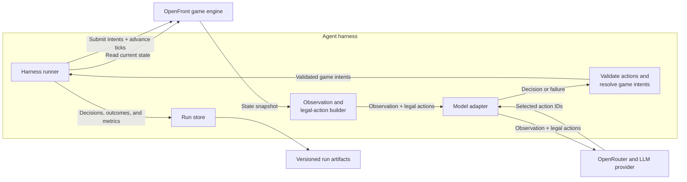

# Building and Evaluating a Reliable Agent Harness for OpenFront

> Historical interface note (August 2026): this retrospective and its charts
> analyze the former two-action agent-v12 harness. The current agent-v13
> harness requires exactly one action per decision; legacy runs remain
> replayable and are not treated as current benchmark results.

Written by Fahim Ahmed

August 5, 2026

<CLIP OF ATTACK-2-CLIPPED.mov HERE>

### **GPT-5.6 couldn't win OpenFront. Using my harness, it won all 10 games.**

Harnesses turn LLM output into actions, connecting probabilistic models to deterministic systems. That connection creates risk, where a small mistake from the model can become an incorrect command with real-world consequences. Reliability is therefore the central engineering problem when building harnesses.

To study that problem, I built an auditable harness for [OpenFront](https://openfront.io/), an open-source real-time strategy game. 
In a fixed Japan-map evaluation, GPT-5.6 Luna lost all 20 trials across two visual browser interfaces. With the harness limiting it to legal, resource-safe actions, the same model won all 10 out of 10 matches.

<BENCHMARK CHART HERE>

_**Special thanks to [Ibrahim Ahmed](http://ibrahimahmed.ca/) ([X](https://x.com/zero_goliath)) for his thoughtful feedback on this project, and to [@0xgodking](https://x.com/0xgodking) for inspiring me to start exploring agent harnesses.**_

## OpenFront in 60 seconds

[OpenFront](https://openfront.io/) is an open-source, browser-based real-time strategy game about territorial control. Each player begins with a small foothold on a map based on real-world geography, then sends troops into neutral land or enemy territory to expand. Troops regenerate over time, but every attack also pulls strength away from defense, so growing too quickly can leave a player exposed. Gold adds another layer, and can be invested in cities, ports, defenses, and military units, while naval invasions and alliances create routes around an otherwise unfavorable land border.

<OPENFRONT GAMEPLAY CLIP HERE>

The game progresses in simulation ticks. In each tick, troops grow, attacks advance, nations respond, buildings finish, and borders change. A player wins immediately by capturing 80% of territory on the map. If time expires first, the surviving player with the most territory wins.

## Why is reliability hard?

Reliability is difficult because an LLM produces probabilistic responses, while OpenFront requires precise, valid commands. The model could invent a player ID, choose an unreachable target, overspend its troops, or return malformed JSON. Even a valid action can become invalid before execution if the game state changes.

This raises the question: **How do you test a harness when the LLM is nondeterministic?** For this harness, I broke that question into three parts:

1. **Action reliability:** Did every accepted decision resolve to a legal game action?
2. **Operational reliability:** Did the harness stay reliable when providers handled the same model differently?
3. **Evaluation reliability:** Could I inspect and replay the run to distinguish bad model decisions from harness failures? Furthermore, is the agent playing the game in a way that makes sense wins?

The harness enforces these properties rather than relying on prompting alone. Before explaining how the harness enforced these properties, the next section will first walks through how the harness works.

## How the harness works



Every 100 ticks, the harness reads the current OpenFront state and gives the model a compact observation. The observation contains information on time, standings, troops, gold, nearby opponents, active attacks, recent outcomes, and a safe troop budget.

Let's give an example from replay [9f73a404-ae98-430f-be5b-ea22fb1755a6](https://openfront.fahimahmed.ca/replay/9f73a404-ae98-430f-be5b-ea22fb1755a6). At 5:50 into the match, the agent controlled 31.884% of Japan with 290,851 troops. It shared land borders with Kansai and Hokkaido, while Shikoku was reachable across the water.

<figure class="data-figure">
  
  <figcaption>Replay 9f73a404 at 5:50, right after the agent sent out troops to attack Kansai and Shikoku.</figcaption>
</figure>

```json
{
  "observation": {
    "elapsedTime": "05:50",
    "territoryPercent": 31.884,
    "troops": {
      "total": 290851,
      "reserve": 102486,
      "spendable": 188364,
      "perActionBudget": 94182
    },
    "opponents": [
      { "name": "Hokkaido", "troops": 93158, "sharedBorder": true },
      { "name": "Kansai", "troops": 55101, "sharedBorder": true },
      { "name": "Shikoku", "troops": 66632, "sharedBorder": false }
    ]
  }
}
```

From the same state, the harness builds a menu of actions that are legal at that moment. These can include expanding, attacking, launching a boat, retreating, constructing or upgrading a building, changing diplomacy, and holding. Each option has a stable ID and maps to an exact OpenFront game command.

```json
"legalActionExcerpt": [
    { "id": "attack:jld9qemv:100", "label": "Attack Kansai by land with 94,182 troops" },
    { "id": "attack:mx6susv9:100", "label": "Attack Hokkaido by land with 94,182 troops" },
    { "id": "boat:d8c1rits:100", "label": "Invade Shikoku by sea with 94,182 troops" },
    { "id": "alliance:request:d8c1rits", "label": "Request an alliance with Shikoku" },
    { "id": "embargo:start:jld9qemv", "label": "Start an embargo against Kansai" },
    { "id": "hold:1", "label": "Hold the first action slot" }
  ]
```

Both the observation and legal actions from above are fed as input into the model. The model chooses up to two IDs instead of generating raw game commands. In this example, the model chose to attack Kansai by land with 94,182 troops and invade Shikoku by sea with 94,182 troops.

```json
{
  "strategy": "Exploit overwhelming reserves: launch decisive attacks on the two weakest rivals while retaining the required 35% troop floor.",
  "action1": "attack:jld9qemv:100",
  "action2": "boat:d8c1rits:100"
}
```

To prevent hallicunation from the model, the harness only accepts valid moves that it gave to the model as legal actions. It also validates the two actions together, for example preventing two individually valid attack actions from spending more than the troop count available.

Once the harness submits an accepted action, OpenFront’s game engine applies it and determines the outcome according to the game’s rules. At the next desicion point 100 ticks later, the harness observes the new state and includes recent action outcomes, so the model can view the results of a previously submitted attack or building.

If a model request times out or returns an invalid response, the harness retries once with the validation error. If the retry also fails, the harness uses a safe fallback by submitting a hold for both action slots and recording the failure in the run trace.

At each decision point, the harness records the state shown to the model, the actions the model selected, any provider or validation errors, and the latency and cost of the request. This is to be able to audit the harness and the model's performance.

This cycle repeats until a player wins or the match reaches its time limit.

## How I made the harness reliable.

Each of the three dimensions mentioned from earlier is enforced by a different part of the harness, and each surfaced differently once real models started playing.

### Action reliability: keeping every accepted move legal

The model never writes OpenFront commands directly. At each decision point, the harness reads the current game state and generates a deterministic menu of actions that are legal at that moment. Each option has a stable ID and maps to an exact game intent, so the model chooses from bounded capabilities instead of inventing player IDs, troop counts, build locations, or command shapes.

<ACTION RELIABILITY DIAGRAM HERE>

I enforce that boundary twice. The request uses a strict JSON Schema whose `action1` and `action2` enums contain only the IDs available to each slot for that decision. When the response returns, the harness parses it with Zod and checks both selections against the original menu again. This second check matters because the provider generates the structured output. Even if the response matches the schema, the harness must still validate each action before executing it.

A move also has to be safe in combination with the other move. The legal-action builder calculates one troop surplus above a reserve floor and divides it across the two action slots. It only offers troop amounts within those slot budgets, which prevents two individually valid attacks from spending the same troops twice. The resolver also replaces invalid duplicates, such as trying to construct two buildings on the same tile, with the appropriate slot's hold action.

If a response is malformed or selects an invalid ID, the harness retries once and includes the specific validation error so the model can correct itself. If the retry also fails, it submits two holds rather than guessing what the model intended. Note that an action that was legal when offered can still fail as the simulation changes, so the harness records whether each action actually started, failed, completed, or was destroyed and feeds recent outcomes into the next observation.

### Operational reliability: controlling provider variability

#### Pinning the model's provider on OpenRouter

The most important operational lesson from this project was that one model (ex. DeepSeek V4 Flash) between two different provider are not actually the same model. OpenRouter can expose the same model through several providers, but each provider can have different latency, pricing, defaults, and feature support. If the harness allowed OpenRouter to choose a provider automatically, the same request could land on a provider that ignored the strict schema, enabled unexpected reasoning, or timed out, turning an otherwise valid decision into an error.

I saw this issue in early DeepSeek V4 Flash tests where I had not pinned a provider or set reasoning explicitly. Some providers returned the expected action response in ~50 output tokens. Others generated 2,049 tokens and hit the output-length limit. The longer responses were caused by provider routes that enabled reasoning by default. When a response ended due to the output limit before the model outputted the action fields, the harness could not recover the move the model intended to make. It rejected the incomplete response, logged a model error, and safely held both action slots as a fallback.


I therefore pin both the model and provider, disable provider fallbacks, explicitly set reasoning to `none`, and record which provider actually served every decision. Each request has a ten-second timeout and one retry. A run also has a $1 inference ceiling, and a limit of 20 game-minutes.

The final evaluation shows what those controls looked like in practice. These are measurements pooled from ten GPT-5.6 Luna runs and five runs each for GLM-5.2 and DeepSeek V4 Flash.

| Model and pinned provider      | Decisions | Median / p95 latency | Completion tokens per decision | Mean cost per run | Retries / fallbacks |
| ------------------------------ | --------: | -------------------: | -----------------------------: | ----------------: | ------------------: |
| GPT-5.6 Luna / OpenAI          |       985 |      1.15 s / 2.93 s |                           54.2 |           $0.0346 |               3 / 0 |
| GLM-5.2 / Baidu                |       531 |      2.75 s / 3.41 s |                           58.8 |           $0.0859 |               8 / 0 |
| DeepSeek V4 Flash / StreamLake |       583 |      2.70 s / 3.99 s |                           49.8 |           $0.0227 |             13 / 11 |

Across the 20 runs, none of the 2,099 decisions had a timeout or JSON Schema violation. The validator rejected 12 conflicting action combinations, and each model corrected its choice on retry. StreamLake also returned 23 upstream rate-limit errors across 12 DeepSeek decisions: one recovered on retry, while 11 exhausted the retry and safely fell back to holds. No invalid command reached the game.

With reasoning explicitly disabled, the final model-provider pairs averaged between 49.8 and 58.8 completion tokens per decision.

#### Testing advertised schema enforcement

The harness uses strict structured output so every response has a predictable shape and the model's two action fields can contain only the legal IDs offered for that decision. This is meant to prevent malformed responses before they reach the harness. DeepSeek's first-party provider did not advertise support for strict JSON Schema through OpenRouter, so I had to choose a third-party provider that did. Baidu advertised support and accepted the requests, but the provider did not reliably enforce the schema.

Across three DeepSeek V4 Flash runs with Baidu as the provider, 45 of 368 response attempts violated the schema: 43 contained an overlong strategy string and two selected action IDs outside the allowed enums. Forty-one decisions were retried, and four still failed and safely fell back to holds.

I then changed only the provider to StreamLake which fixed this issue. All 344 response attempts conformed to the schema. Interestingly enough, GLM-5.2 through Baidu did not have the same schema failure, suggesting the problem was specific to using DeepSeek through Baidu, rather than DeepSeek, Baidu, or the harness itself.


The lesson is to treat advertised provider capabilities as claims to verify. Test and pin the exact model and provider, set options explicitly, record the provider used, and validate every response.

### Evaluation reliability: making every run auditable

One of my key design decisions was to make every run auditable. At each decision point, the harness records what the model observed, which actions it could take, what it chose, and why. I then added a UI that lets me watch the agent play, inspect unexpected decisions or error flags, and use the trace to determine whether a problem came from the model or from the harness.

From this auditability, I was able to diagnose two interesting failures I ran into.

1. An early version of the observation JSON called the immediate territory threshold `winPercent`. In one evaluation, GLM-5.2 interpreted a value of `80` as an 80% probability of winning and used it to justify holding off from any action, even though it controlled far less than 80% of the map. Because the decision trace showed exactly what the model had seen and how it reasoned from that value, I could pin the failure to the field name rather than the model's judgment. To fix this, I renamed the field to `instantVictoryTerritoryPercent`, and GLM-5.2 won in its next run. From this, I learned that even a small ambiguity in the wording of a state variable could cause the model to behave incorrectly.

2. In another run with DeepSeek V4 Flash, an older version of the instruction prompt told the model to "hold while rebuilding", but did not explain that troop growth approaches zero near full capacity. The model made no moves for 58 of its 61 decisions, stopped gaining meaningful troops, and was eventually conquered by another nation. This failure did not trigger a harness error because every hold was valid. The trace showed the problem, where the model repeatedly chose to hold because it believed doing so would rebuild its troops, even near full capacity. I removed the "hold while rebuilding" instruction and made the underlying troop-growth mechanic explicit. More specifically, the observation now reports the agent's troop-capacity percentage and current growth rate, and the prompt explains that holding near 100% capacity will not rebuild the army further. As a result, the next DeepSeek run, the agent expanded aggressively and reached first place!

From this, I learned the importance of not having biases in a prompt, and the importance of exposing more relevant information to the model for it to use when making a decision.


From having to manually judge multiple runs, I learned that while the harness should prevent invalid actions, but it should not encode an entire winning strategy. Telling the model what to do in the prompt may backfire and have the model behave unexpectedly. As a result, I kept the harness neutral and would only expose game state and game mechanics, rather than biasing the prompts with what the model should or shouldn't do.

## Evaluating the models

The eval task was to win a fixed four-player match on the Japan map. GPT-5.6 Luna always spawned in Kanto and played against the same three medium-difficulty built-in nations with the same engine seed. A trial succeeded if the model captured 80% of Japan for an immediate victory or, when the 20-minute timer expired, was still alive and controlled more territory than every opponent. I ran ten trials per interface under the same decision timing.

To measure what GPT-5.6 Luna could do on its own, I let the model play OpenFront on its own using browser screenshots and primitive browser inputs.
There were two versions of this baseline: one with a control manual given as input, and one without (where the model would have to discover the game's controls).

Both of these gave me a baseline against which to compare my harness against.

<div class="eval-conditions">
  <div class="eval-condition eval-condition-header" aria-hidden="true">
    <span>Interface</span>
    <span>Description</span>
  </div>
  <div class="eval-condition">
    <h3>Visual Browser Control</h3>
    <p>The model received the current 1280×720 screenshot and the goal of winning. It could control the browser using mouse, keyboard, scroll, wait, and done commands, but received no OpenFront rules or control instructions.</p>
  </div>
  <div class="eval-condition">
    <h3>Visual Browser Control + Game Manual</h3>
    <p>The model received the same screenshots, goal, and browser controls, plus a game manual explaining OpenFront's public rules, controls, and keybindings.</p>
  </div>
  <div class="eval-condition">
    <h3>OpenFront Harness</h3>
    <p>The model received a compact summary of the game state, recent action results, safe troop budgets, and a list of currently legal actions. It could choose up to two actions, which the harness validated and translated into exact game commands.</p>
  </div>
</div>

The two visual interfaces still use a thin evaluator to reproduce and score the scenario. Unlike the trials for the OpenFront Harness, the Visual Browser also stopped simulated time while the model was thinking, due to having several sequential model calls. This is another benefit of the OpenFront Harness, only requiring one model call for a decision.

Nonetheless, the evaluator for the Visual Browser interfaces did not give the model DOM data, OCR, normalized game state, legal actions, coordinate hints, or semantic feedback from the game. Furthermore, the public game manual was the only intended difference between the two visual baselines.

The results of the evaluation task will be in the next section.

## Results

### The harness enabled GPT-5.6 Luna to consistently win

The primary eval metric was whether the model won the match. Across ten completed trials per condition, the observed win rate increased by 100 percentage points: 0/10 with Visual Browser Control, 0/10 with Visual Browser Control + Game Manual, and 10/10 with the Harness.

| Interface                            | Trials | Wins | Observed win rate (95% Wilson interval) |
| ------------------------------------ | -----: | ---: | --------------------------------------: |
| Visual Browser Control               |     10 |    0 |                            0% (0–27.8%) |
| Visual Browser Control + Game Manual |     10 |    0 |                            0% (0–27.8%) |
| Harness                              |     10 |   10 |                        100% (72.2–100%) |

### Harness performance

I ran ten harness evaluations of GPT-5.6 Luna and five each of DeepSeek V4 Flash and GLM-5.2. Every run used the same Japan map, spawn point, three medium-difficulty opponent bots with the same seed, one decision every 100 ticks, and a 20-minute limit. Model reasoning was disabled for all the runs. I pinned the provider as well as the model, with StreamLake for DeepSeek, Baidu for GLM, and OpenAI for GPT, all through OpenRouter.

| Model and provider             |  Wins | How the wins ended     | Mean final territory | Mean decisions | Mean prompt / completion tokens | Median decision latency | Mean inference cost |
| ------------------------------ | ----: | ---------------------- | -------------------: | -------------: | ------------------------------: | ----------------------: | ------------------: |
| GPT-5.6 Luna / OpenAI          | 10/10 | 5 at 80%, 5 on timer   |                75.0% |           98.5 |                 253,496 / 5,335 |                  1.15 s |             $0.0346 |
| GLM-5.2 / Baidu                |   5/5 | 2 at 80%, 3 on timer   |                69.0% |          106.2 |                 261,251 / 6,245 |                  2.75 s |             $0.0859 |
| DeepSeek V4 Flash / StreamLake |   2/5 | 2 timer wins, 3 losses |                33.3% |          116.6 |                 289,194 / 5,812 |                  2.70 s |             $0.0227 |

GPT and GLM produced the strongest and most consistent results in this sample: GPT won all ten of its runs, while GLM won all five of its runs. GPT won five matches by crossing 80% territory and five by leading when the timer expired; GLM had two immediate victories and three timer victories. DeepSeek's two wins were timer wins with 32.2% and 40.1% of the territory captured. Its three losses ended in second place with 17.5%, 42.7%, and 34.0%. It is important to distinguish the two types of wins: win rate alone hides a meaningful difference between conquering the map and surviving with the most territory.


The shape of the win is easier to see in the decision trace. In the representative run above, GPT expanded rapidly for the first three minutes, consolidated around 30% of the map, then converted a series of later attacks into an 82.4% victory at 13:25.


The three representative matches above show different paths to crossing the 80% victory threshold. Across the full ten-run evaluation, GPT crossed that threshold in five matches and led when the timer expired in the other five, establishing a winning territory lead in every run.

The decision traces show different play styles behind those outcomes. In the balanced five-run subset shown below, counting attack, boat, and counter actions together, GPT used a combat action in 342 of 1,002 action slots (34.1%), compared with 289 of 1,062 for GLM (27.2%) and 34 of 1,166 for DeepSeek (2.9%). DeepSeek selected a hold in 76.8% of its slots and made no combat move at all in one of its two wins. Across all ten GPT runs, it used combat actions in 620 of 1,970 slots (31.5%).

DeepSeek's passiveness was not accidental. It recognized that it did not need to conquer 80% of the map to win: if it was still alive and held the most territory when time expired, it would win. Once it established a lead, its recorded strategies repeatedly said that holding would preserve the lead while the other three bot nations fought one another. In the 40.1% win, it explicitly reasoned that holding preserved its troops "for timer victory." This turned inaction into a strategy that avoided the downside of further combat, protected a plurality of the map, and ran out the clock. It worked in two of five runs; in the other three, Hokkaido finished ahead and DeepSeek placed second.


The models showed different play styles. GPT attacked most often, GLM was less aggressive, and DeepSeek mostly held. Despite those differences, the harness kept execution safe. Every final action was legal and stayed within its troop budget. Twelve responses initially selected conflicting action combinations, but the validator rejected them and the models corrected themselves on retry. No invalid command reached the game.

## What I learned from building a harness and evaluating it.

First, agent performance reflects the whole system, not just the model. GPT-5.6 Luna failed to win any of the 20 visual browser trials, but the same model won all ten games through the harness. Changing the interface and the information available to the model changed what it could accomplish.

Second, win rate alone is not enough to understand performance. Placement, territory, consistency, and how each match ended revealed meaningful differences between models and their type of wins. Crossing the 80% territory win threshold is different from winning by holding a lead until the timer expired.

Third, an eval needs replayable evidence. Each result should be traceable from what the model observed, through the decision it made and the action the harness executed, to what happened in the environment. Without that evidence, it is difficult to distinguish a model failure from a harness failure or defend the resulting score.

Fourth, a reliable eval requires a reliable harness. The same model behaved differently depending on which provider served it. Pinning the provider, setting reasoning explicitly, and recording failures helped ensure that the results reflected the agent's performance rather than differences in the infrastructure.

## Building reliable agent evals

I'm continuing to build evaluations for agents operating in interactive environments. The goal is to measure not only whether an agent succeeds, but how reliably it acts over time with controlled scenarios, comparable runs, and replayable evidence.

If you're building agents and need a custom evaluation, benchmarking study, or pilot, [get in touch](https://www.linkedin.com/in/fahim-a/).
